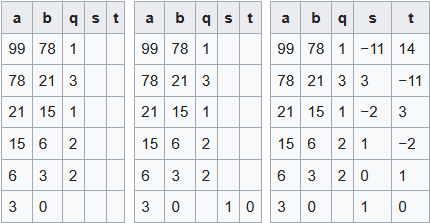

================
Zahlentheorie
================

.. contents::
    :local:

1. Teilbarkeit
===============

In diesem Abschnitt ist :math:`\mathbb{Z}` die Grundmenge.

.. _01_01_def_01:

Definition 1: Teiler
****************************************************

.. math::

    \newcommand{\gz}{\mathbb{Z}}

Für zwi Zahlen :math:`m, n \in \gz` mit :math:`m>0` ist m Teiler n, falls es ein :math:`t\in \gz` gibt, so dass
:math:`n=t*m`. Kurzschreibweise: :math:`m\mid n`

Beispiel 1:
^^^^^^^^^^^^^^^^

:math:`2\mid 6`, da :math:`2*3=6`

:math:`2\nmid 6`, da :math:`\forall t \in \gz \;  7 \ne t*2`

Spezialfälle:
^^^^^^^^^^^^^^^^^^

:math:`1\mid n`, da :math:`n = n * 1`

:math:`n\mid n` für :math:`n > 0`, da :math:`n = 1 * n` für :math:`n<0` gilt das nicht, da lt.
:ref:`01_01_def_01` der :math:`Teiler>0` sein muss.

:math:`m\mid 0`, da :math:`0=0*m`

.. _01_01_def_02:

Definition 2: Teilermenge
****************************************************

Für eine Zahl :math:`n \in \gz` ist :math:`T_n` die Menge aller Teiler von :math:`n`.
Also :math:`T_n = \{k>0 : k\mid n\}`

Beispiel 2:
^^^^^^^^^^^^^^

:math:`T_6 = \{1,2,3,6\}`

:math:`T_7 = \{1,7\}`

Modulo
========

Ist `m` kein teiler von n, so bleibt bei der Division ein Rest. Für :math:`n,t,m,r \in \gz` und :math:`m, r > 0`
können wir dann schreiben: :math:`n = t*m+r`. Dabei wählen wir `t` maximal, so dass :math:`t*m \le n`.
Also :math:`t=\lfloor \frac{n}{m} \rfloor`.
Eingesetzt :math:`n=\lfloor \frac{n}{m}\rfloor *m+r \Leftrightarrow r=n-\lfloor \frac{n}{m} \rfloor *m`.
Da :math:`\lfloor \frac{n}{m} \rfloor *m \le n`, ist :math:`r\ge 0`. Andererseits ist :math:`r<m`, da
:math:`\lfloor \frac{n}{m} \rfloor` der größte Faktor ist. Somit ist :math:`t*m\le n \Rightarrow` Es gilt:
:math:`r \in \{0, 1, ..., m-1\}`

.. _01_01_def_03:

Definition 3: Modulo
****************************************************

Die Menge der möglichen Reste ist :math:`Z_m=\{0,1,...,m-1\}` Bei der ganzzahligen Division von `n` durch
`m` bezeichnet man `m` als den \underline{Modul} und den Rest `r` als `n` modulo `m`, kurz :math:`n \mod m`.

Folgerung 1:
****************************************************

Für :math:`n,m\in\gz` mit :math:`m>0` und :math:`r=n \mod m`gilt: :math:`m\mid (n-r)`

**Beweis:**

.. todo::

    Add Beweis

Eine Zahl `n` kann für feste `m` auf viele Arten in der Form :math:`n=t*m+r` geschrieben werden. Beschränkt man
`r` auf :math:`\{0,1,...,m-1\}`, dann gibt es nur noch eine Darstellung.

Theorem
****************************************************

Sei :math:`n,m\in \gz` und :math:`m>0`. Die Darstellung :math:`n=t*m+r`mit :math:`0\le r \lt m` ist eindeutig.

Teilbarkeit - Fortsetzung
==========================

.. _01_01_def_04:

Definition 4: Schnittmenge von Teilmengen
****************************************************

Für zwei Zahlen :math:`m,n\in\gz` ist :math:`T_{m,n}=T_m \cap T_n`

.. _01_01_def_05:

Definition 5: Größter gemeinsamer Teiler (ggT)
****************************************************

Für zwei Zahlen :math:`m,n\in\gz` mit :math:`m,n\ne0` ist der größte gemeinsame Teiler, kurz `ggT(m,n)`, die größte
Zahl in :math:`T_{m,n}`. Also :math:`max(T_{m,n})`

Formal:

.. math::

    ggT(m,n)=max(\{k\in \mathbb{N} : k>0 \cap k\mid m \cap k\mid n\})

.. _01_01_def_06:

Definition 6: Kleinstes gemeinsames Vielfaches (kgV)
*****************************************************

Das kleinste gemeinsame Vielfache von :math:`m,n\in\gz` mit :math:`m,n>` ist die kleinste Zahl, die von `m` und `n`
geteilt wird.

Formal:

.. math::

    kgV(m,n)=min(\{k\in \mathbb{N} : k>0 \cap m\mid k \cap n\mid k\})

Beispiel:
^^^^^^^^^^^^^^

.. math::
    :nowrap:

    \begin{align*}
    T_{12} &= \{1,2,3,4,6,12\}\\
    T_{18} &= \{1,2,3,6,9,18\}\\
    T_{12,18} &= \{1,2,3,6\}\\
    ggT(12,18)&=6\\
    kgv(12,18)&=36
    \end{align*}

::

    Ziel effiziente Berechnung des ggT.

Lemma 1:
*********

Für alle :math:`a,b\in\gz` ist :math:`T_{m,n}\subseteq T_{a*m+b*n}`

Beweis:
^^^^^^^^

Sei :math:`k\in T_{m,n}` ein beliebiger Teiler von `m` und `n`. D.h. es gibt :math:`s,t\in\gz`, so dass :math:`m=s*k`
und :math:`n=t*k`. Dann gilt: :math:`a*m+b*n = a*s*k+b*t*k = k*(a*s+b*t)`. Folglich gilt: :math:`k \mid (a*m+b*n)`.

Spezialfall:
^^^^^^^^^^^^^^^^

Für den ggT: :math:`ggT(m,n)\mid (a*m+b*n)`.

Beispiel:
^^^^^^^^^^

.. math::
    :nowrap:

    \begin{align*}
    m = 12, \; n=18, &\; a=-1, \; b=2\\
    a*m+b*n &= 1*12+2*18 = 24\\
    T_{12,18} &= \{1,2,3,6\}\\
    T_{24} &=\{1,2,3,4,6,8,12,24\}\\
    T_{12,18} &\subseteq T_{24}\\
    \end{align*}

:math:`\Rightarrow` Teilmenge :math:`T_{a*m+b*n}` enthält im allgemeinen mehr Zahlen als :math:`T_{m,n}`.
Es wäre jedoch von Vorteil, mindestens eine der Zahlen `m`, `n` zu verkleinern, ohne :math:`T_{m,n}` zu verkleinern.

.. _01_01_fol_02:

Folgerung 2:
*************

Für alle :math:`a\in\gz` ist :math:`T_{m,n} = T_{m,n-a*m}`

.. todo::

    Beweis: :math:`T_{m,n} \subseteq T_{m,n-a*m}`

Beispiel:
^^^^^^^^^^

.. math::
    :nowrap:

    \begin{align*}
    a &= -1 \; \#beliebig\\
    T_{12,18} \subseteq T_{12,18-12} &= T_{12,6}\\
    T_{12} &= \{1,2,3,4,6,12\}\\
    T_{18} &= \{1,2,3,6,9,18\}\\
    T_6 &= \{1,2,3,6\}\\
    T_{12,18} &= \{1,2,3,6\}\\
    T_{12,6} &= \{1,2,3,6\}
    \end{align*}

.. todo::

    Beweis: :math:`T_{m,n} \supseteq T_{m,n-a*m}`

Wählt man in :ref:`01_01_fol_02` :math:`a\ge 1`, so verkleinert sich das Zahlenpaar :math:`(m,n)` zu :math:`(m,n-a*m)`.
Trotzdem bleiben die gemeinsamen Teiler die selben. Je kleiner das Zahlenpaar :math:`(m,n-a*m)` wird, desto einfacher
kann der ggT bestimmt werden. Folglich wählen wir `a` maximal, so dass :math:`n-a*m \ge 0` ist.

:ref:`01_01_fol_02` (:math:`T_{m,n} = T_{m,n-a*m})` gilt unter anderem für :math:`a=\lfloor \frac{n}{m} \rfloor` (da
:math:`\lfloor \frac{n}{m} \rfloor * m \le n`, deshalb wird `a` maximal). Eingesetzt:
:math:`n-a*m=n-\lfloor \frac{n}{m} \rfloor *m = n \mod m`.

Folgerung 3:
*************

Für :math:`m>0` gilt: :math:`T_{m,n}=t_{m,n\mod m}`

Euklidischer Algorithmus
**************************

Rekursive Formulierung:
^^^^^^^^^^^^^^^^^^^^^^^^

.. code-block:: none

    Euklid(m,n)
        if m=0 then
            return n
        else
            return Euklid(n mod m, m)

Iterative Formulierung:
^^^^^^^^^^^^^^^^^^^^^^^^

.. code-block:: none

    Euklid(m,n)
        while m>0 do
            r <- n mod m
            n <- m
            m <- r
        return n

Folgerung 4:
************

:math:`T_{m,n}=T_{ggT(m,n)}`. D.h. jeder gemeinsamer Teiler von `n` und `m` teilt folglich auch den `ggT(m,n)`.

Beispiel: Euklidiescher Algorithmus - kürzen von Brüchen
^^^^^^^^^^^^^^^^^^^^^^^^^^^^^^^^^^^^^^^^^^^^^^^^^^^^^^^^^^

:math:`\frac{233408}{344512}` soll auf die kleinstmögliche Form gekürzt werden.

====== =============== ============================== ===============
i       :math:`n_i`     Berechnung: :math:`m_i`         :math:`m_i`
====== =============== ============================== ===============
0       344512                                            233408
1       233407          :math:`344512 \mod 233408`      = 111104
2       111104          :math:`233407 \mod 111104`      = 11200
3       11200           :math:`111104 \mod 11200`       = 896
4       896             :math:`11200 \mod 896`          = 448
5       448             :math:`896 \mod 448`            = 0
====== =============== ============================== ===============

:math:`\Rightarrow ggT(233408, 344512)=448`

:math:`\Rightarrow \frac{233408}{344512} = \frac{\frac{233408}{448}}{\frac{344512}{448}} = \frac{512}{729}`

Theorem 2:
*************

Es gibt :math:`a,b\in\gz`, so dass :math:`a*m+b*n=ggT(m,n)`.

Beweis:
^^^^^^^^

.. todo::

    Beweis

Erweiterter Euklidischer Algorithmus
*************************************

.. code-block:: none

    EuklidErweitert(m,n)
        if m = 0 then
            return (n, 0, 1)
        else
            (d, b', a') <- EuklidErweitert(n mod m, m)
            a <- a' - b'(n div m)
            b <- b'
            return (d, a, b)

Beispiel:
^^^^^^^^^^

Namen der Variablen sind anders: a=n, b=m, b=s, a=t

    Erweiterter Euklidischer Algorithmus Schema für 99 und 78

:math:`ggT(99, 78)=99*(-11)+78*14=3`

