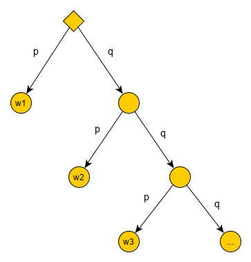

Wahrscheinlichkeitsräume
=============================

.. contents::
    :local:

Definition 1: Wahrscheinlichkeitsraum
**************************************

.. role:: def
    :class: underline

Ein (diskreter [#f1]_) :def:`Wahrscheinlichkeitsraum` ist eine :def:`Ergebnissmenge`
:math:`\Omega = \{\omega_1, \omega_2\, \omega_3, ...\}` [#f2]_ von :def:`Elementarerignissen`
:math:`\omega_1, \omega_2\, \omega_3, ...` . Jedem :math:`\omega_i` ist eine :def:`Wahrscheinlichkeit`
:math:`Pr[\omega_i]` zugeordnet, so dass gilt:

    - :math:`0\le Pr[\omega_i] \le 1`
    - :math:`\sum_{\omega_i\in \Omega} Pr[\omega_i] = 1`

Definition 2: Ereignis
************************

Die Wahrscheinlichkeit von :def:`Ereignis` :math:`E\subseteq\Omega` ist:

.. math:: Pr[E] = \sum_{\omega\in E} Pr[\omega]

Ein Ereignis E :def:`tritt ein`, wenn eines der Elementarereignissen aus E eintritt.

Speziell:
^^^^^^^^^^

    - :math:`\emptyset` - das :def:`unmögliche Ereignis`
    - :math:`\Omega` - das :def:`sichere Ereignis`

Definition 3: Komplementär Ereignis
************************************

Das :def:`komplementäre Ereignis` zu E ist :math:`\bar E=\Omega-E`.

Definition 4: Relative Häufigkeit bzw. Wahrscheinlichkeit
*************************************************************

Statistik über die Häufigkeit von Ereignis E.

:def:`Relative Häufigkeit (E)` :math:`=\frac{absolute Häufigkeit (E)}{Anzahl Messungen}`

Relative Häufigkeiten gelten als Erwartungen für die Zukunft und können als :def:`Wahrscheinlichkeiten` (Wk., en:
*propability*) betrachtet werden.

Für die Wahrscheinlichkeit eines Ereignisses E, werden die Wahrscheinlichkeiten der Elementarereignissen in E
aufsummiert.

Definition 5: Laplace Experiment:
***********************************

Alle Elementarereignisse :math:`\omega_i` einer endlichen Ergebnismenge :math:`\Omega` sind gleich wahrscheinlich.

.. math:: Pr[\omega]=\frac{1}{\vert\Omega\vert}, \;\; \forall\omega\in\Omega

Allgemein für ein Ereignis E:

.. math:: Pr[E]=\frac{\vert E\vert}{\vert\Omega\vert}

Lemma:
^^^^^^^^^^^^

:math:`0\le\frac{1}{\vert\Omega\vert}\le 1` und

:math:`\sum_{\omega\in\Omega}Pr[\omega]=\sum_{\omega\in\Omega}\frac{1}{\vert\Omega\vert}=
\frac{1}{\vert\Omega\vert}\sum_{\omega\in\Omega}1=\frac{1}{\vert\Omega\vert} * \vert\Omega\vert = 1`

Beispiele:
^^^^^^^^^^^^^^

1. Würfel (Laplace Experiment)

    :math:`\Omega=\{1,2,3,4,5,6\}`

    :math:`Pr[k]=\frac{1}{6}` mit :math:`1\le k\le 6`

    Ereignis :math:`P=\{k\in\Omega\mid k\; ist\; prim\} = \{2,3,5\}`

    :math:`Pr[P]=3*\frac{1}{6}=\frac{1}{2}`

2. Münze: 3-mal werfen (Laplace Experiment)

    :math:`\Omega=\{k,z\}^3`  , :math:`\vert\Omega\vert = 8`

    :math:`Pr[\omega]=\frac{1}{8}`

    E = genau einmal k

    :math:`Pr[E]=3*\frac{1}{8}=\frac{3}{8}`

3. Urne:

    5 Bälle, 2 rot (r) und 3 schwarz (s)

    Ziehe 2 mal ohne Zurücklegen.

    :math:`\Omega=\{r,s\}^2`  , :math:`\vert\Omega\vert = 4`

    .. figure:: assets/baumdiagramm_01.png
        :alt: Baumdiagramm: 5 Bälle, 2 rot (r) und 3 schwarz (s), 2 mal ziehen ohne Zurücklegen

        Baumdiagramm: 5 Bälle, 2 rot (r) und 3 schwarz (s), 2 mal ziehen ohne Zurücklegen

    E = 2. Kugel ist rot :math:`=\{sr, rr\}`

    :math:`Pr[E]=\frac{3}{10}+\frac{1}{10}=\frac{4}{10}=\frac{2}{5}`

Beispiel: Nachweis für Wk.-Raum
^^^^^^^^^^^^^^^^^^^^^^^^^^^^^^^^^^^^^^^^

Signalübertragung über Kanal. Erfolgreiche Übertragung mit Wk. `p`. Mit welcher Wk. braucht man `k` Versuche bis zu
einer erfolgreichen Übertragung?

Definiere Elementarereignisse:

:math:`\omega_i =` erfolgreiche Übertragung erstmals beim `i`-ten Versuch

:math:`\Omega =\{\omega_1,\omega_2,\omega_3,...\}`

Übertragung schlägt fehl mit Wk. :math:`q=1-p`.

    Baumdiagramm: zur Signalübertragung

:math:`Pr[\omega_i]=q^{i-1}*p`

:math:`\sum_{i=1}^\infty Pr[\omega_i]=\sum_{i=1}^\infty q^{i-1}p=p*\sum_{i=0}^\infty
q^i=p*\frac{1}{1-q}=p*\frac{1}{p}=1`

:math:`\Rightarrow` Wk.-Raum

**Bsp.**

Ereignis :math:`A_k=` Erfolg in weniger gleich `k` Versuchen :math:`=\{\omega_1,\omega_2,...,\omega_k\}`

:math:`Pr[A_k]=\sum_{i=1}^k Pr[\omega_i]=\sum_{i=1}^k q^{i-1}p=p*\sum_{i=0}^{k-1}q^i=p*\frac{1-q^k}{1-q}=1-q^k=1-
(1-p)^k`

*Anmerkung:* :math:`q^k` geht exponentiell gegen :math:`0`.
Also geht :math:`1-(1-p)^k` exponentiell gegen :math:`1`.

Eigenschaften
**************

Seien :math:`A,B\in\Omega` Ereignisse.

1. :math:`Pr[\emptyset]=0`, (da :math:`0\le Pr[\emptyset]\le 1-Pr[\Omega]=0`) und :math:`Pr[\Omega]=1` (nach Definition)
2. :math:`Pr[\bar A]=1-Pr[A]`

        :math:`A \cup \bar A= \Omega \Rightarrow Pr[\bar A] + Pr[A] = Pr[\Omega] = 1`

3. :math:`A\subseteq B \Rightarrow Pr[A] \le Pr[B]`

        :math:`Pr[B]=\sum_{\omega\in B}Pr[\omega]=\sum_{\omega\in A}Pr[\omega] + \sum_{\omega\in B-A}Pr[\omega] \ge
        \sum_{\omega\in A}Pr[\omega]=Pr[A]`

4. :math:`A \cap B = \emptyset \Rightarrow Pr[A \cup B]=Pr[A] + Pr[B]`

        :def:`Additionssatz`: :math:`\sum_{\omega\in A \cup B}Pr[\omega] =
        \sum_{\omega\in A}Pr[\omega] + \sum_{\omega\in B}Pr[\omega]`

        Allgemeiner für :math:`A_1, A_2, ...` paarweise disjunkt gilt:

        .. math:: Pr[\bigcup_{i\ge 1}A_i]=\sum_{\omega\in A}Pr[A_i]

5. :math:`Pr[A \cup B]=Pr[A]+Pr[B]-Pr[A \cap B]`

        :def:`Siebformel`:

        .. math::
            :nowrap:

            \begin{align*}
            \vert A\cup B\vert &= \vert A\vert + \vert B\vert -\vert A\cap B\vert\\

            \vert A\cup B \cup C\vert &= \vert A\vert + \vert B\vert +\vert C\vert  -(\vert A\cap B\vert +
            \vert A\cap C\vert + \vert B\cap C\vert) + \vert A\cap B \cap C\vert\\\\

            \vert A_1\cup A_2 \cup ... \cup A_n\vert &= \\
            = \sum_{i=1}^n \vert A_i \vert - \sum_{1\le i < j \le n} \vert &
            A_i \cap A_j \vert + \sum_{1\le i<j<k \le n} \vert A_i \cap A_j \cap A_k \vert -+... + (-1)^{n+1}\vert
            A_1 \cap ... \cap A_n \vert
            \end{align*}

Beweis: Allgemeine Siebformel
^^^^^^^^^^^^^^^^^^^^^^^^^^^^^^^^

Sei :math:`a\in A_1 \cup A_2 \cup ... \cup A_n` beliebig.

Zeige: `a` wird durch die Formel auf der rechten Seite genau einmal gezählt.

Komme `a` in `m` der Mengen :math:`A_1, A_2,..., A_n` vor. (:math:`1\le m \le n`)
    - `a` wird in :math:`S_1` m-mal gezählt
    -   :math:`\;\;\;` \- " - :math:`\;\;\;\;S_2 \;\;{m \choose 2}`-mal gezählt (=Anzahl Paare aus m Elementen)
    -   :math:`\;\;\;` \- " - :math:`\;\;\;\;S_k \;\;{m \choose k}`-mal gezählt
    -   :math:`\;\;\;` \- " - :math:`\;\;\;\;S_m \;{m \choose m}`-mal gezählt
    -   :math:`\;\;\;` \- " - :math:`\;\;\;\;S_n \;\;\;\; 0`-mal gezählt

:math:`\Rightarrow a` wird :math:`{m \choose 1} - {m \choose 2} + {m \choose 3}-+...+(-1)^{m+1}{m \choose m}` - mal
gezählt.

..

    Binomialtheorem: :math:`(x+y)^n=\sum_{k=0}^n{n \choose k}x^k y^{n-k}`

Setze  :math:`x=-1, \; y=1 ,\; n\ge 1`

.. math::
    :nowrap:

    \begin{gather*}
    (-1+1)^n=0=\sum_{k=0}^n {n \choose k}(-1)^k={n \choose 0}-{n \choose 1}+{n \choose 2}-...+(-1)^n{n \choose n}\\
    \Leftrightarrow {n \choose 1}-{n \choose 2}+{n \choose 3}-...+(-1)(-1)^n{n \choose n} = 1

    \end{gather*}

:math:`\Rightarrow a` wird 1-mal gezählt. (`n` wird durch `m` ersetzt und :math:`(-1)(-1)^n = (-1)^{m+1}`)

Folgerung:
***********

.. math::
    :nowrap:

    \begin{gather*}
    Pr[A_1\cup A_2 \cup ... \cup A_n] = \\
    \sum_{i=1}^n Pr[A_i] - \sum_{1\le i < j \le n} Pr[
    A_i \cap A_j] + \sum_{1\le i<j<k \le n} Pr[ A_i \cap A_j \cap A_k] -+... + (-1)^{n+1}Pr[
    A_1 \cap ... \cap A_n]
    \end{gather*}

Beispiel:
^^^^^^^^^^^^^^

`n` Seeleute kehren betrunken auf ihr Schiff zurück. Jeder fällt zufällig in eine Koje. Mit welcher Wk. liegt keiner
in seiner eigenen Koje? (Komplementär: Min. ein Seemann liegt in seiner Koje)

Seemann `i` gehört Koje `i`, :math:`i=1,2,...,n`. Jede Verteilung der Seeleute auf die Kojen ist eine Permutation
:math:`\pi \in S_n`, d.h. :math:`\pi:[n] \rightarrow [n]`.

Ereignis :math:`A_i=` Seemann `i` liegt in seiner Koje `i`, d.h. :math:`A_i=\{\pi\in S_n \mid \pi (i)=i\}`

:math:`\vert S_n \vert = n!`

:math:`\vert A_i \vert = (n-1)!`, da `n-1` Seeleute beliebig auf `n-1` Kojen verteilt werden.

:math:`Pr[\pi]=\frac{1}{\vert S_n\vert}=\frac{1}{n!}` (Laplace-prinzip)

:math:`Pr[A_i]=\frac{\vert A_i\vert}{\vert S_n\vert}=\frac{(n-1)!}{n!}=\frac{1}{n}`

:math:`A=A_1\cup A_2\cup ... \cup A_n =` min ein Seemann liegt in der richtigen Koje.

.. math::
    :nowrap:

    \begin{align*}
    i<j: \;\;\vert A_i \cap A_j\vert &= (n-2)! \\
    i<j<k: \;\;\vert A_i \cap A_j \cap A_k\vert &= (n-3)! \\
    ...\\
    \vert A_1 \cap A_2\cap ... \cap A_n\vert &= (n-n)!=0!=1 \\

    \Rightarrow \vert A_1\cup A_2\cup ... \cup A_n \vert &= \sum_{i=1}^n \vert A_i \vert - \sum_{1\le i < j \le n} \vert
    A_i \cap A_j \vert + \sum_{1\le i<j<k \le n} \vert A_i \cap A_j \cap A_k \vert -+... + (-1)^{n+1}\vert
    A_1 \cap ... \cap A_n \vert\\
    &= \sum_{k=1}^n (-1)^{k+1} {n \choose k}(n-k)!\\
    &= \sum_{k=1}^n (-1)^{k+1} \frac{n!}{k!(n-k)!} * (n-k)!\\
    &= n!*\sum_{k=1}^n \frac{(-1)^{k+1}}{k!}\\
    \Rightarrow Pr[A]&=\frac{\vert A\vert}{\vert S_n\vert}=\frac{n!*\sum_{k=1}^n \frac{(-1)^{k+1}}{k!}}{n!}=
    \sum_{k=1}^n \frac{(-1)^{k+1}}{k!}\\

    Pr[\bar A]&=1-Pr[A]=1-\sum_{k=1}^n \frac{(-1)^{k+1}}{k!}=\sum_{k=0}^n \frac{(-1)^{k}}{k!}
    \xrightarrow{n\to\infty}\frac{1}{e} \approx 0.36788

    \end{align*}

**Hinweis:** :math:`\sum_{0}^\infty \frac{1}{k!}=e` und  :math:`\sum_{0}^\infty \frac{x^k}{k!}=e^x`

:math:`Pr[\bar A]` ist die Wk., dass keiner in seiner Koje liegt.

.. rubric:: Fußnoten

.. [#f1] Aufzählbar und isolierte Objekte
.. [#f2] Unendlich viele Objekte möglich
