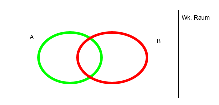

Bedingte Wahrscheinlichkeiten
================================

.. role:: def
    :class: underline

.. contents::
    :local:

    Mengendiagramm mit den Mengen `A` und `B`

**Frage:** Wk. von `A`, wenn man bereits weiß, dass `B` eingetreten ist.

Definition 1: Bedingte Wahrscheinlichkeit
*******************************************

:math:`\Omega` Wk.raum, :math:`B \subseteq \Omega`, :math:`A \subseteq \Omega` und :math:`Pr[B]>0`. Die
:def:`bedingte Wahrscheinlichkeit A gegeben B` ist definiert durch:

.. math::

    Pr[A\mid B]=\frac{Pr[A\cap B]}{Pr[B]}

Falls :math:`Pr[B]=0`, definiere: :math:`Pr[A\mid B]=0`

Eigenschaften: Bedingte Wahrscheinlichkeit
*********************************************

1. :math:`A=B: \;\; Pr[B\mid B] =\frac{Pr[B\cap B]}{Pr[B]}=1`
2. :math:`A \cap B=\emptyset : \;\; Pr[A\mid B] =\frac{Pr[\emptyset]}{Pr[B]}=0`
3. :math:`B=\Omega : \;\; Pr[A\mid \Omega] =\frac{Pr[A \mid \Omega]}{Pr[\Omega]}=Pr[A]`

Beispiele:
^^^^^^^^^^^^

1. Würfel (Laplace Experiment)

    :math:`p=Primzahl=\{2,3,5\}`, :math:`u=ungerade=\{1,3,5\}`, :math:`p\cap u=\{3,5\}`

    :math:`Pr[p]=Pr[u]=\frac{1}{2}`

    :math:`Pr[p \mid u]=\frac{Pr[p\cap u]}{Pr[u]}=\frac{\frac{1}{3}}{\frac{1}{2}}=\frac{2}{3}`

2. 2 Kinder

    :math:`\Omega=\{j,m\}^2=\{jj, jm, mj, mm\}`

    :math:`B=\{jm, mj, mm\}`, :math:`A=\{mm\}`, :math:`A\cap B=\{mm\}`

    :math:`Pr[A \mid B]=\frac{Pr[A \cap B]}{Pr[B]}=\frac{\frac{1}{4}}{\frac{3}{4}}=\frac{1}{3}`

    C = 1. Kind ist :math:`m=\{mj, mm\}`

    :math:`Pr[A \mid C]=\frac{Pr[A \cap C]}{Pr[C]}=\frac{\frac{1}{4}}{\frac{1}{2}}=\frac{1}{2}`

.. _02_multiplikationssatz:

Multiplikationssatz
*********************

Seien :math:`A_1,A_2,...,A_n \subseteq \Omega` Ereignisse mit :math:`Pr[A_1\cap A_2\cap ... \cap A_n]>0`. Dann gilt:

.. math::

    Pr[A_1\cap A_2\cap ... \cap A_n]=Pr[A_1]*Pr[A_2\mid A_1] * Pr[A_3\mid A_1\cap A_2] * Pr[A_n\mid A_1\cap A_2\cap
    ... \cap A_{n-1}]

Beweis:
^^^^^^^^

Definition einsetzen: :math:`Pr[A_1\cap A_2\cap ... \cap A_n]=Pr[A_1] * \frac{Pr[A_1\cap A_2]}{Pr[A_1]} *
\frac{Pr[A_1\cap A_2 \cap A_3]}{Pr[A_1 \cap A_2]} * \frac{Pr[A_1\cap A_2 \cap ... \cap A_n]}{Pr[A_1\cap A_2 \cap ...
\cap A_{n-1}]}`

Alle Nenner sich durch den vorherigen Zähler raus. Nur der Zähler vom letzten Term bleibt stehen. Somit stimmt die
Gleichung.

**Beachte:** :math:`A_1 \supseteq A_1 \cap A_2 \supseteq ... \supseteq A_1 \cap ... \cap A_n`

:math:`\Rightarrow Pr[A_1]\ge Pr[A_1\cap A_2] \ge ... \ge Pr[A_1 \cap ... \cap A_n] \ge 0`

Beispiel: Geburtstagsproblem
^^^^^^^^^^^^^^^^^^^^^^^^^^^^^^^^

:math:`\Omega=\{1,2,...,n=365\}`, :math:`m` Personen zufällig.

A = alle `m` Personen haben an unterschiedlichen Tagen Geburtstag.

Personen :math:`1, 2, ..., m`

:math:`A_i=` Person `i` hat an einem anderen Tag Geburtstag als die Personen :math:`1,2,.., i-1`.
D.h. :math:`A=A_1\cap A_2 \cap ... \cap A_m`

:math:`Pr[A_1] = 1`

:math:`Pr[A_2\mid A_1] = \frac{n-1}{n}`

:math:`Pr[A_3\mid A_1 \cap A_2] = \frac{n-2}{n}`

:math:`Pr[A_j\mid A_1 \cap A_2 \cap ... \cap A_{j-1}] = \frac{n-(j-1)}{n}`

Nach :ref:`02_multiplikationssatz`:

.. math::
    :nowrap:

    \begin{align*}
    Pr[A]&=1*\frac{n-1}{n}*\frac{n-2}{n}*...*\frac{n-(m-1)}{n}\\
    &=\prod_{j=1}^m\frac{n-(j-1)}{n} = \prod_{j=1}^m (1-\frac{j-1}{n}) \le \prod_{j=1}^m e^{-\frac{j-1}{n}} =\\
    &= e^{-\frac{1}{n}* \sum_{j=1}^m (j-1)} = e^{-\frac{1}{n}* \sum_{j=0}^{m-1} (j)} = e^{-\frac{(m-1)m}{2n}}\\

    \end{align*}

.. todo::

    Check formula end

**Hinweis:** :math:`1-x\le e^{-x}`

Satz: Totale Wahrscheinlichkeit
**********************************

Seien :math:`A_1,A_2,...,A_n \subseteq \Omega` paarweise disjunkt [#paarweisedisjunkt]_. Sei :math:`B \subseteq
\Omega` mit :math:`B \subseteq A_1 \cup A_2\cup ...\cup A_n`, dann gilt:

.. math:: Pr[B]=\sum_{i=1}^n Pr[B \mid A_i]*Pr[A_i]

Beweis:
^^^^^^^^^^

:math:`B=(B\cap A_1)\cup (B\cap A_2) \cup ... \cup (B\cap A_n)`

:math:`\Rightarrow Pr[B]= \sum_{i=1}^n Pr[B \cap A_i] = \sum_{i=1}^n Pr[B \mid A_i]*Pr[A_i]`, da :math:`B\cap A_i`
paarweise disjunkt sind mit :math:`i=1,...,n`.

**Hinweis**: :math:`Pr[A \mid B] = \frac{Pr[A\cap B]}{Pr[B]} \Leftrightarrow Pr[A\cap B] = Pr[A | B] * Pr[B]`

Satz von Bayes:
****************

Seien :math:`A_1,A_2,...,A_n \subseteq \Omega` paarweise disjunkt [#paarweisedisjunkt]_,
:math:`B \subseteq A_1 \cup A_2\cup ...\cup A_n` und :math:`Pr[B]>0`, dann gilt:

.. math:: Pr[A_i|B]=\frac{\Pr[A_i\cap B]}{Pr[B]}=\frac{Pr[B|A_i]*Pr[A_i]}{\sum_{i=1}^n Pr[B \cap A_i]*Pr[A_j]}

**Hinweise:** Dadurch wird es möglich aus :math:`Pr[A|B]`, :math:`Pr[B|A]` zu berechnen. Dies is möglich, da das UND
kommutativ ist.

Beispiel: Datenübertragung über Kanal mit Fehlern (noisy)
^^^^^^^^^^^^^^^^^^^^^^^^^^^^^^^^^^^^^^^^^^^^^^^^^^^^^^^^^^

Übertragen wird Bit 0 oder 1.

Ereignisse: für :math:`i=0,1`

:math:`S_i=` Bit `i` wird gesendet.

:math:`R_i=` Bit `i` wird empfangen.

Es gelte: :math:`Pr[S_0]=0,3 \;\;, Pr[S_1]=0,7`

    Fehler: :math:`Pr[R_1|S_0]=0,3 \;\;, Pr[R_0|S_1]=0,1`

Frage: Wk. für Übertragungsfehler?

.. math::
    :nowrap:

    \begin{align*}
    Pr[Ü-Fehler]&=Pr[(S_1\cap R_0) \cup (S_0 \cap R_1)]\\
    &= Pr[S_1\cap R_0] + Pr[S_1\cap R_1]\\
    &= Pr[R_0|S_1]*Pr[S_1]+Pr[R_1|S_0]*Pr[S_0]\\
    &= 0,1 * 0,7+0,3*0,3 = 0,16\\
    \end{align*}

Andere WK.'s:

.. math::
    :nowrap:

    \begin{align*}
    Pr[R_1] &= Pr[R_1|S_0]*Pr[S_0]+Pr[R_1|S_1]*Pr[S_1] & NR: Pr[R_1|S_1] = 1-Pr[R_0\mid S_1]\\
    &= 0,3*0,3+0,9*0,7=0,72\\
    Analog: Pr[R_0]&=0,28 \;\;oder\;\; 1 - 0,72 = 0,28\\
    Pr[S_1 \mid R_1]&=\frac{Pr[R_1\mid S_1]*Pr[S_1]}{Pr[R_1]}=\frac{0,9*0,7}{0,72}=0,875\\
    Analog: Pr[S_0\mid R_0]&=0,75
    \end{align*}

Beispiel: 3 Münzen
^^^^^^^^^^^^^^^^^^^^

Gegeben sind 3 Münzen von denen 2 fair sind und eine gefälscht ist. Für die Gefälschte gilt: :math:`Pr[K]=\frac{2}{3}`.

Wähle die Reihenfolge und werfe jede zufällig.

:math:`E_i=` Münze `i` ist gefälscht, :math:`i=1,2,3`

:math:`Pr[E_i]=\frac{1}{3}`, :math:`\Omega=\{K,Z\}^3`

Ergebnis sei:
                === === ===
                 1   2   3
                === === ===
                 K   K   Z
                === === ===

Frage: Wie groß ist die Wk., dass Münze 1 die gefälschte Münze ist?

:math:`B=\{(K,K,Z)\}`

:math:`Pr[E_1\mid B] = ?`

:math:`Pr[B\mid E_1] = \frac{2}{3}*\frac{1}{2}*\frac{1}{2}=\frac{1}{6}`

:math:`Pr[B\mid E_2] = \frac{1}{2}*\frac{2}{3}*\frac{1}{2}=\frac{1}{6}`

:math:`Pr[B\mid E_3] = \frac{1}{2}*\frac{1}{2}*\frac{1}{3}=\frac{1}{12}`

:math:`Pr[E_1\mid B]=\frac{Pr[B\mid E_1]*Pr[E_1]}{\sum_{i=1}^3 Pr[B\mid E_i]*Pr[E_i]} = \frac{2}{5}`

Definition: Unabhängigkeit
****************************

`A` und `B` sind :def:`voneinander unabhängig`, falls das Zutreffen von Ereignis `B`, die Wk. von `A` nicht ändert.
D.h. es gilt: :math:`Pr[A\mid B] = Pr[A]` Folglich: :math:`\frac{Pr[A\cap B}{Pr[B]}=Pr[A]`

.. math:: \Rightarrow Pr[A\cap B]=Pr[A]*Pr[B]

Ist :math:`Pr[A]>0`, dann folgt :math:`Pr[B]=\frac{Pr[A\cap B]}{Pr[A]}=Pr[B\mid A]`

Beispiel: 2 Würfel, geordnet
^^^^^^^^^^^^^^^^^^^^^^^^^^^^^^

A = 1. Würfel ist gerade

B = 2. Würfel ist gerade

C = Summe ist 7

:math:`\Omega = [6]^2`

Definiere: :math:`G=\{2,4,6\}`

:math:`A=G\times [6]`, :math:`\vert A\vert=3*6=18`, :math:`Pr[A]=\frac{18}{36}=\frac{1}{2}`

:math:`B=[6]\times G`, :math:`\vert B\vert=6*3=18`, :math:`Pr[A]=\frac{18}{36}=\frac{1}{2}`

:math:`C=\{(1,6),(2,5),(3,4),(4,3),(5,2),(6,1)\}`, :math:`Pr[C]=\frac{1}{6}`

:math:`Pr[A\cap B]=Pr[G\times G]=\frac{9}{36}=\frac{1}{4}=Pr[A]*Pr[B]\Rightarrow` `A` und `B` sind unabhängig.

:math:`Pr[A\cap C]=Pr[\{(2,5), (4,3), (6,1)\}]=\frac{3}{36}=\frac{1}{12}=Pr[A]*Pr[C]\Rightarrow` `A` und `C` sind
unabhängig. Analog: :math:`B\cap C \Rightarrow` A/B sind unabhängig von C.

:math:`Pr[A\cap B \cap C]=Pr[\emptyset]=0\ne Pr[A]*Pr[B]*Pr[C]\Rightarrow` Nicht alle drei sind unabhängig.

Definition: Unabhängigkeit von n Ereignissen
*********************************************

:math:`A_1,A_2,...,A_n` heißen :def:`unabhängig`, falls:

.. math:: \forall I \subseteq [n] : Pr[\bigcap_{i\in I}A_i]=\prod_{i\in I}Pr[A_i]

**Erklärung:** Alle möglichen Kombinationen werden betrachtet und müssen unabhängig sein.

Satz:
*******

Sind `A` und `B` unabhängig, dann sind auch unabhängig:
    - :math:`\bar A` und :math:`B`
    - :math:`A` und :math:`\bar B`
    - :math:`\bar A` und :math:`\bar B`

Beweis: zu :math:`\bar A,\; B`
^^^^^^^^^^^^^^^^^^^^^^^^^^^^^^^^

:math:`\bar A \cap B = B-A=B-(A\cap B) \Rightarrow (\bar A \cap B)\cup (A\cap B) = B` [#disjunktindef]_

:math:`\Rightarrow Pr[(\bar A \cap B)\cup (A\cap B)] = Pr[\bar A \cap B] + Pr[A\cap B] = Pr[\bar A\cap B] +
Pr[A]*Pr[B] =Pr[B]`

.. math::
    :nowrap:

    \begin{align*}
    Pr[\bar A \cap B] &= Pr[B]-Pr[A]*Pr[B]\\
    &= (1-Pr[A])*Pr[B]
    &= Pr[\bar A]*Pr[B]
    \end{align*}

Analog für :math:`A,\; \bar B`. Damit folgt auch, dass :math:`\bar A` und :math:`\bar B` unabhängig sind.

Beweis: für :math:`\bar A \cap \bar B`
^^^^^^^^^^^^^^^^^^^^^^^^^^^^^^^^^^^^^^^^

A, B unabhängig :math:`\Rightarrow \bar A,\; B` unabhängig. Def: :math:`\bar A = C`. :math:`\Rightarrow C,\;
\bar B` unabhängig :math:`\Rightarrow \bar A,\; \bar B` unabhängig.

.. rubric:: Fußnoten

.. [#paarweisedisjunkt] Werden zwi beliebige Mengen geschnitten, ist der Schnitt immer leer
.. [#disjunktindef] :math:`\bar A\cap B ` und :math:`A \cap B` sind disjunkt